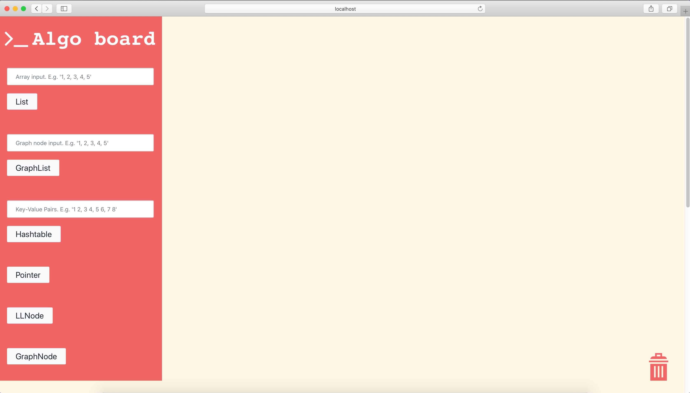
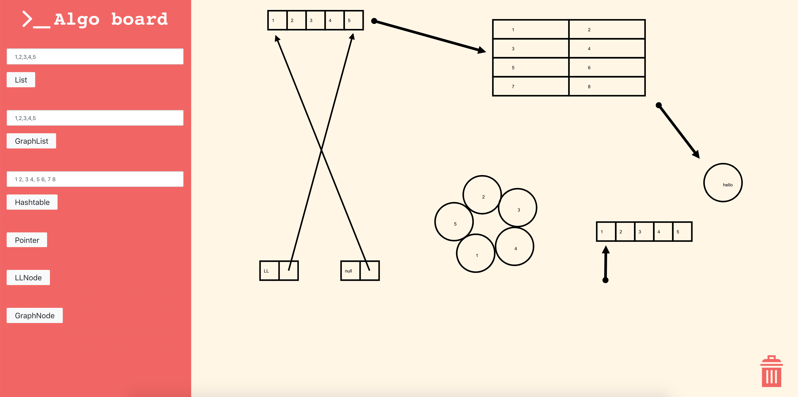
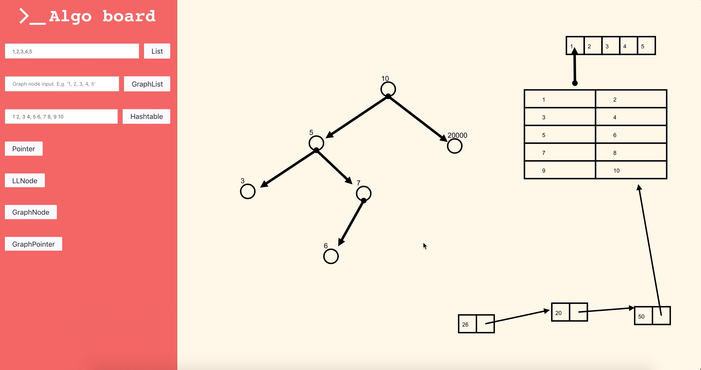

# Algo Board

Algo Board is a free online interactive tool for educators to teach data structure. Drag-and-drop data structures included out of the box for explaining complex algorithms.

## Quick installation guide

- Install by cloning the repo `git clone https://github.com/wn96/algo-board.git`
- `cd algo-board`
- Install node dependancies: `npm install`
- To start app: `npm start`
- The app should run on http://localhost:3000

## Features

This app contains the following data structures and its features:

| Data Structure | Features                                                                                                                                |
| -------------- | --------------------------------------------------------------------------------------------------------------------------------------- |
| List           | \* Create the array data structure with custom size and inputs. Also dynamic change of data too!                                        |
| GraphList      | \* Create a couple of GraphNode, allowing educators to scaffold a graph in no time!                                                     |
| Hash Table     | \* The famous dictionary ADT. Need I say more?                                                                                          |
| Pointer        | \* A pointer that can serve to perform address mapping, or as a marker for educators to indicate which node they are explaining. Nifty! |
| LLNode         | \* A LinkedList Node that locks neighboring pointers, just like a real LinkedList.                                                      |
| GraphNode      | \* A single Graph Node for TreeNode, TrieNode or just your regular node. All in one.                                                    |

## Screenshots

## Upcoming Features

- [ ] Allow selection of color for data structures.
- [ ] Text box.
